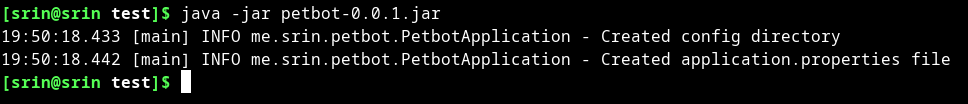
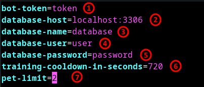

# Pet bot

## get started

- Download the jar file from the release
- Then open terminal and navigate to the folder where you've downloaded the jar file
- Then type `java -jar petbot-VERSION.jar` and press enter. _Replace VERSION with the version you've downloaded_  
  _example:_
  
  _This will create an **application.properties** file in a **config** folder_
- Open the **application.properties** file in a text editor  
  _example:_  
  