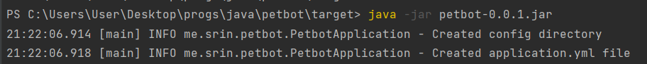
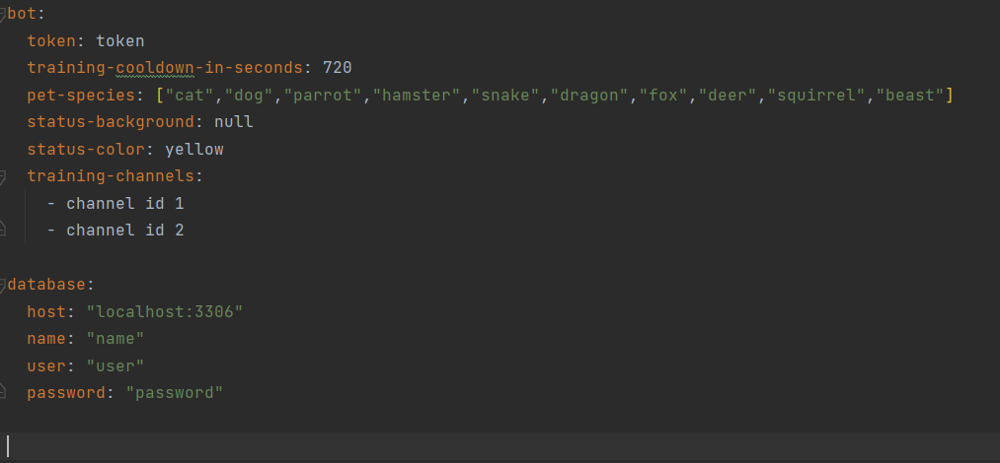
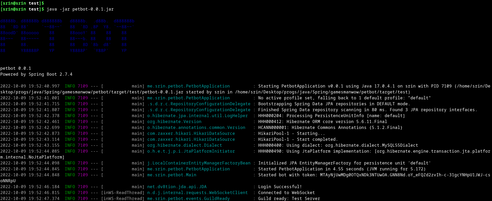
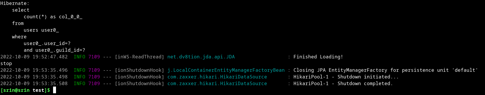

# Pet bot

## Prerequisite 
A mysql database.
* Either set it up for your PC by downloading the installer from [here](https://dev.mysql.com/downloads/mysql/)
* Or set it up in a VPS online

## get started

- Download the jar file from the [release](https://github.com/SrinSS01/petbot/releases)
- Then open terminal and navigate to the folder where you've downloaded the jar file
- Then type `java -jar petbot-VERSION.jar` and press enter. _Replace VERSION with the version you've downloaded_  
  _example:_  
    
  _This will create an **application.yml** file in a **config** folder_
- Open the **application.yml** file in a text editor  
  _Replace the default values with your own suitable values_  
    
### bot
* `token` - Your bot token
* `training-cooldown-in-seconds` - Enter the cooldown time(in seconds) for the training period of a pet
* `pet-species` - list all the pet types in an array as given in the example
* `status-background` - Provide the link to the background image to be used when displaying the status UI
* `status-color` - Mention the color name that is to be used in the status UI elements like the progress bar
* `training-channels` - List all the channel ids of the training channels where the pet is supposed to train

### database
* `host` - The host name of your mysql database
* `name` - Name of the database that you are using
* `user` - Name of the user for the database. _The user must have permissions the manage tables in the database_
* `password` - Password of the user

   _a sample **application.yml** file:_
```yaml
bot:
  token: "MTAyajUwMDg0dTQxNDk3NTgvOA.GIoGfX.upRN993rN2nX3HaS6wF5ZVIkgT6RpIh2mQq3ws"
  training-cooldown-in-seconds: 6000
  pet-species: ["cat","dog","parrot","hamster","snake","dragon","fox","deer","squirrel","beast"]
  status-background: "https://images.unsplash.com/photo-1610878180933-123728745d22?ixlib=rb-4.0.3&ixid=MnwxMjA3fDB8MHxzZWFyY2h8Mnx8bW9yYWluZSUyMGxha2V8ZW58MHx8MHx8&w=1000&q=80"
  status-color: yellow
  training-channels:
    - 1033585143438389338
    - 1033585214531842128
    - 1018780667405926421
database:
  host: "localhost:3306"
  name: "testdatabase"
  user: "user"
  password: "1234"
```
   
- Then save the file and exit the text editor.
- Repeat 2nd and 3rd step

    
  
- If all the values in **application.properties** file are correct then the bot will start without any issues   
  and log a message `Login Successful!` to the console
## Stop the bot

To stop the bot just type `stop` in the console and press enter. This should stop the bot and it'll go offline.


