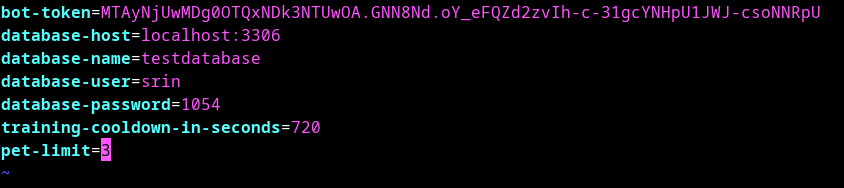

# Pet bot

## Prerequisite 
A mysql database.
* Either set it up for your PC by downloading the installer from [here](https://dev.mysql.com/downloads/mysql/)
* Or set it up in a VPS online

## get started

- Download the jar file from the release
- Then open terminal and navigate to the folder where you've downloaded the jar file
- Then type `java -jar petbot-VERSION.jar` and press enter. _Replace VERSION with the version you've downloaded_  
  _example:_
  
  _This will create an **application.properties** file in a **config** folder_
- Open the **application.properties** file in a text editor  
  _Replace the default values with your own suitable values_  
    
1. `bot-token` - Your bot token
2. `database-host` - The host name of your mysql database
3. `database-name` - Name of the database that you are using using
4. `database-user` - Name of the user for the database. _The user must have permissions the manage tables in the database_
5. `databse-password` - Password of the user
6. `training-cooldown-in-seconds` - Enter the cooldown time(in seconds) for the training period of a pet
7. `pet-limit` - Maximum pets a user can have  

   _a sample **application.properties** file:_
   
   
- Then save the file and exit the text editor.
- Repeat 2nd and 3rd step

    
  
- If all the values in **application.properties** file are correct then the bot will start without any issues   
  and log a message `Login Successful!` to the console
## Stop the bot

To stop the bot just type `stop` in the console and press enter. This should stop the bot and it'll go offline.

